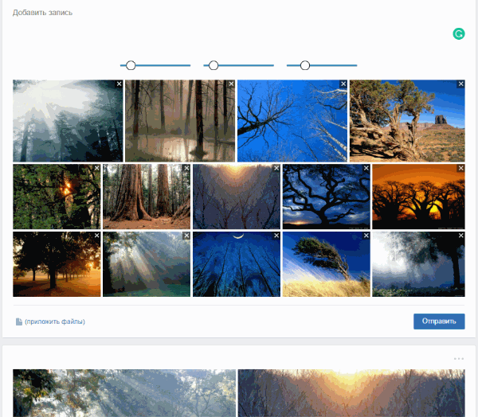

# Diary

 

Web application for personal user diaries.
The application backs everything up to `cloud.mail.ru` for safety.

Application supports media layout fine tuning:

First toolbar to set the first image size.  
Second toolbar to set the second image size.  
Third toolbar to set number of rows to be shown.

## Installation

- create an empty database
- copy `db.php.sample` into `db.php` and set the database access credentials
- copy `config.php.sample` into `config.php` and set access credentials to the mail.ru storage
- run `<your_domain>/install` and enter password for 'admin' user
- in `<your_domain>/admin` area use "admin" login and password set by you during installation
- go to `/admin/app/user-list` and create a new user

Now you can log in into the diary

### License

Application is [MIT licensed](./LICENSE).
